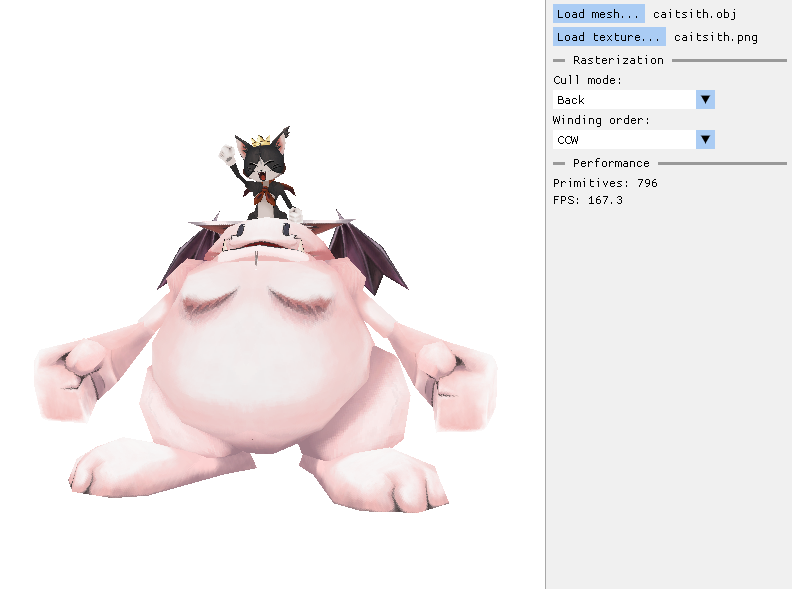

# Yet Another CPU Rasterizer

This a **3D Software Rasterizer** built from scratch in C++. I'm continuously working on it to teach myself computer graphics! 

## Features
- Custom .obj parser
- Triangle rasterization, customizable through UI (supports choosing culling mode and triangles winding order)
- Automatic scaling to support models of different sizes without a need to change anything in the camera setup
- Ability to easily set and define user-specific Vertex (defaults tp MVP matrix) and Fragment (defaults to texture mapping) shaders
- Perspective correct attribute interpolation
- Tile-based rasterization
- Multithreading using C++20 features (specifically `std::barrier`) and lock-free work distribution across a thread pool, resulting in ~190 FPS on Ryzen 7 9700X

## To do:
- <s>Optimize perfomance and overall rasterizer design</s>
- Shading and lighting! 
- <s>Multithreading!!</s>

## Gallery

 

## Tech stack
- C++20
- GLM for math 
- SDL3 for window application rendering
- stb_image for texture loading
- ImGui for UI (duh)

## Prerequisites

To build and run this project, you will need:

1.  **A C++ Compiler:** (GCC, Clang, or MSVC)
2.  **CMake:** Version 3.16 or higher.

## How to Build

This project takes advantage of CMake's FetchContent feature, so you don't need to install any libraries yourself!

### Using an IDE
1.  Open the project in your IDE
2.  The IDE should automatically detect the `CMakeLists.txt` 
3.  Build and run the project!

### Using the Command Line
1.  Open a terminal in the project root directory
2.  Create a build directory:
    ```bash
    mkdir build && cd build
    ```
3.  Configure the project:
    ```bash
    cmake ..
    ```
    *Note: The first time you run this, CMake will download and build glm and SDL3. This may take a few minutes.*
4.  Build the project:
    ```bash
    cmake --build .
    ```
5.  Run the application

## Resources
### Rasterization:
- https://lisyarus.github.io/blog/
- https://tayfunkayhan.wordpress.com/2018/12/16/rasterization-in-one-weekend-part-ii/
- https://www.scratchapixel.com/lessons/3d-basic-rendering/rasterization-practical-implementation/overview-rasterization-algorithm.html
- https://www.songho.ca/opengl/index.html
- https://tayfunkayhan.wordpress.com/2019/07/26/chasing-triangles-in-a-tile-based-rasterizer/
- lots of reddit posts and OpenGl documentation discussions

### UI:
- https://pthom.github.io/imgui_explorer/

### 3D models:
- https://casual-effects.com/data/
- "Cait Sith low-poly model" (https://skfb.ly/oKQpV) by NiNoStyle is licensed under Creative Commons Attribution (http://creativecommons.org/licenses/by/4.0/).
